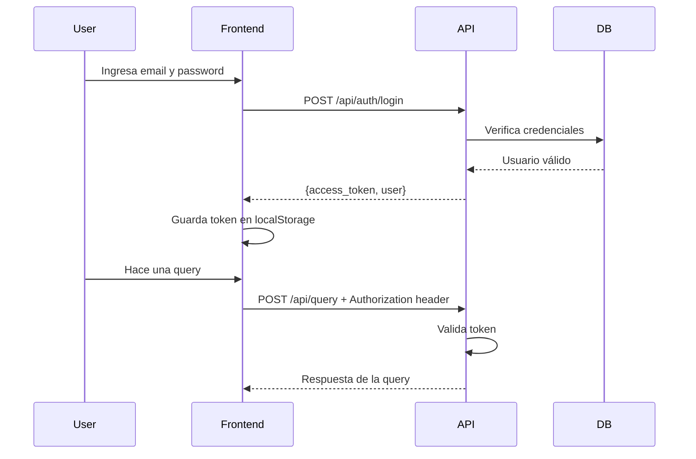

# API de Autenticación y Usuarios - Documentación Frontend

## 📋 Resumen de Cambios

### ⚠️ CAMBIO IMPORTANTE: Todos los endpoints ahora requieren autenticación

**Antes:**
```javascript
// POST /api/query
{
  "query": "¿Cuánto vendimos?",
  "user_id": "123",
  "session_id": "optional"
}
```

**Ahora:**
```javascript
// POST /api/query
// Headers: Authorization: Bearer <token>
{
  "query": "¿Cuánto vendimos?",
  "session_id": "optional"  // user_id se elimina, viene del token
}
```

El campo `user_id` **ya no se envía** en el body. El sistema lo obtiene automáticamente del JWT token.

---

## 🔐 Flujo de Autenticación



---

## 📡 Base URL

```
http://localhost:8000
```

---

## 🔓 Endpoints Públicos (Sin Autenticación)

### 1. Health Check

```http
GET /health
```

**Respuesta:**
```json
{
  "status": "healthy"
}
```

### 2. Login

```http
POST /api/auth/login
Content-Type: application/json
```

**Body:**
```json
{
  "email": "admin@vorta.com",
  "password": "admin123"
}
```

**Respuesta exitosa (200):**
```json
{
  "access_token": "eyJhbGciOiJIUzI1NiIsInR5cCI6IkpXVCJ9...",
  "token_type": "bearer",
  "user": {
    "user_id": "0cbdab40-f680-4e67-b6b7-737d1f966b64",
    "email": "admin@vorta.com",
    "name": "Admin",
    "last_name": "User",
    "admin": true,
    "created_at": "2026-01-31T23:35:04.899545",
    "updated_at": "2026-01-31T23:35:04.899545"
  }
}
```

**Errores:**
- **401**: Email o contraseña incorrectos
```json
{
  "detail": "Incorrect email or password"
}
```

---

## 🔒 Endpoints Autenticados (Requieren JWT)

**Todos los siguientes endpoints requieren el header:**
```http
Authorization: Bearer <access_token>
```

### 3. Obtener Usuario Actual

```http
GET /api/auth/me
Authorization: Bearer <token>
```

**Respuesta (200):**
```json
{
  "user_id": "uuid",
  "email": "admin@vorta.com",
  "name": "Admin",
  "last_name": "User",
  "admin": true,
  "created_at": "2026-01-31T23:35:04.899545",
  "updated_at": "2026-01-31T23:35:04.899545"
}
```

**Errores:**
- **401**: Token inválido o expirado

---

### 4. Query (MODIFICADO)

```http
POST /api/query
Authorization: Bearer <token>
Content-Type: application/json
```

**Body (CAMBIÓ):**
```json
{
  "query": "¿Cuánto vendimos en enero?",
  "session_id": "optional-session-id"
}
```

**⚠️ IMPORTANTE:** 
- Ya **NO** se envía `user_id` en el body
- El `user_id` se obtiene automáticamente del token JWT
- El header `Authorization` es **obligatorio**

**Respuesta (200):**
```json
{
  "message": [
    {
      "type": "text",
      "data": "Respuesta del agente..."
    }
  ],
  "metadata": {
    "session_id": "uuid_timestamp",
    "query_type": "simple",
    "latency_ms": 1234.56,
    "type": "simple_agent"
  }
}
```

**Errores:**
- **401**: Token inválido, expirado o faltante
- **403**: Usuario sin permisos (si aplica)

---

### 5. Query con Streaming

```http
POST /api/query/stream
Authorization: Bearer <token>
Content-Type: application/json
```

**Body (CAMBIÓ):**
```json
{
  "query": "Análisis de ventas",
  "session_id": "optional"
}
```

Igual que `/api/query`, ya **NO** incluye `user_id`.

**Respuesta:** Server-Sent Events (SSE)

---

### 6. Obtener Sesión

```http
GET /api/session/{session_id}
Authorization: Bearer <token>
```

**Respuesta (200):**
```json
{
  "session_id": "session-id",
  "messages": [...]
}
```

---

### 7. Limpiar Sesión

```http
DELETE /api/session/{session_id}
Authorization: Bearer <token>
```

**Respuesta (200):**
```json
{
  "status": "cleared",
  "session_id": "session-id"
}
```

---

### 8. Limpiar Cache (Admin)

```http
POST /api/admin/clear-cache
Authorization: Bearer <token>
```

**Respuesta (200):**
```json
{
  "message": "Router cache cleared successfully"
}
```

---

## 👥 Endpoints de Gestión de Usuarios (SOLO ADMIN)

### 9. Crear Usuario

```http
POST /api/users
Authorization: Bearer <admin-token>
Content-Type: application/json
```

**Body:**
```json
{
  "email": "usuario@ejemplo.com",
  "password": "password123",
  "name": "Juan",
  "last_name": "Pérez",
  "admin": false
}
```

**Validaciones:**
- Email: válido y único
- Password: mínimo 8 caracteres
- Name/Last_name: mínimo 1 carácter

**Respuesta (201):**
```json
{
  "user_id": "new-uuid",
  "email": "usuario@ejemplo.com",
  "name": "Juan",
  "last_name": "Pérez",
  "admin": false,
  "created_at": "2026-01-31T...",
  "updated_at": "2026-01-31T..."
}
```

**Errores:**
- **400**: Email ya existe
- **401**: Token inválido
- **403**: Usuario no es admin
- **422**: Datos de validación incorrectos

---

### 10. Listar Usuarios

```http
GET /api/users
Authorization: Bearer <admin-token>
```

**Respuesta (200):**
```json
[
  {
    "user_id": "uuid",
    "email": "admin@vorta.com",
    "name": "Admin",
    "last_name": "User",
    "admin": true,
    "created_at": "2026-01-31T...",
    "updated_at": "2026-01-31T..."
  },
  {
    "user_id": "uuid2",
    "email": "usuario@ejemplo.com",
    "name": "Juan",
    "last_name": "Pérez",
    "admin": false,
    "created_at": "2026-01-31T...",
    "updated_at": "2026-01-31T..."
  }
]
```

**Errores:**
- **401**: Token inválido
- **403**: Usuario no es admin

---

### 11. Obtener Usuario por ID

```http
GET /api/users/{user_id}
Authorization: Bearer <admin-token>
```

**Respuesta (200):**
```json
{
  "user_id": "uuid",
  "email": "usuario@ejemplo.com",
  "name": "Juan",
  "last_name": "Pérez",
  "admin": false,
  "created_at": "2026-01-31T...",
  "updated_at": "2026-01-31T..."
}
```

**Errores:**
- **401**: Token inválido
- **403**: Usuario no es admin
- **404**: Usuario no encontrado

---

### 12. Actualizar Usuario

```http
PUT /api/users/{user_id}
Authorization: Bearer <admin-token>
Content-Type: application/json
```

**Body (todos los campos son opcionales):**
```json
{
  "email": "nuevoemail@ejemplo.com",
  "name": "Nuevo Nombre",
  "last_name": "Nuevo Apellido",
  "password": "nuevapassword123",
  "admin": true
}
```

**Respuesta (200):**
```json
{
  "user_id": "uuid",
  "email": "nuevoemail@ejemplo.com",
  "name": "Nuevo Nombre",
  "last_name": "Nuevo Apellido",
  "admin": true,
  "created_at": "2026-01-31T...",
  "updated_at": "2026-01-31T..."
}
```

**Errores:**
- **400**: Email ya existe
- **401**: Token inválido
- **403**: Usuario no es admin
- **404**: Usuario no encontrado

---

### 13. Eliminar Usuario

```http
DELETE /api/users/{user_id}
Authorization: Bearer <admin-token>
```

**Respuesta (204):** Sin contenido

**Errores:**
- **401**: Token inválido
- **403**: Usuario no es admin
- **404**: Usuario no encontrado

---

## 💻 Implementación Frontend

### Setup Inicial

```javascript
// constants/api.js
export const API_BASE_URL = 'http://localhost:8000';
export const TOKEN_KEY = 'auth_token';
```

### 1. Servicio de Autenticación

```javascript
// services/authService.js

class AuthService {
  async login(email, password) {
    const response = await fetch(`${API_BASE_URL}/api/auth/login`, {
      method: 'POST',
      headers: {
        'Content-Type': 'application/json',
      },
      body: JSON.stringify({ email, password }),
    });

    if (!response.ok) {
      const error = await response.json();
      throw new Error(error.detail || 'Login failed');
    }

    const data = await response.json();
    
    // Guardar token y usuario
    localStorage.setItem(TOKEN_KEY, data.access_token);
    localStorage.setItem('user', JSON.stringify(data.user));
    
    return data;
  }

  logout() {
    localStorage.removeItem(TOKEN_KEY);
    localStorage.removeItem('user');
  }

  getToken() {
    return localStorage.getItem(TOKEN_KEY);
  }

  getUser() {
    const userStr = localStorage.getItem('user');
    return userStr ? JSON.parse(userStr) : null;
  }

  isAuthenticated() {
    return !!this.getToken();
  }

  isAdmin() {
    const user = this.getUser();
    return user?.admin === true;
  }
}

export default new AuthService();
```

### 2. Cliente HTTP con Interceptor

```javascript
// services/apiClient.js
import authService from './authService';

class ApiClient {
  async request(endpoint, options = {}) {
    const token = authService.getToken();
    
    const config = {
      ...options,
      headers: {
        'Content-Type': 'application/json',
        ...options.headers,
      },
    };

    // Agregar token si existe
    if (token) {
      config.headers['Authorization'] = `Bearer ${token}`;
    }

    const response = await fetch(`${API_BASE_URL}${endpoint}`, config);

    // Manejar error 401 (token expirado o inválido)
    if (response.status === 401) {
      authService.logout();
      window.location.href = '/login';
      throw new Error('Session expired. Please login again.');
    }

    // Manejar error 403 (sin permisos)
    if (response.status === 403) {
      throw new Error('You do not have permission to perform this action.');
    }

    if (!response.ok) {
      const error = await response.json().catch(() => ({}));
      throw new Error(error.detail || `HTTP ${response.status}`);
    }

    // Para DELETE 204 sin contenido
    if (response.status === 204) {
      return null;
    }

    return response.json();
  }

  get(endpoint) {
    return this.request(endpoint, { method: 'GET' });
  }

  post(endpoint, data) {
    return this.request(endpoint, {
      method: 'POST',
      body: JSON.stringify(data),
    });
  }

  put(endpoint, data) {
    return this.request(endpoint, {
      method: 'PUT',
      body: JSON.stringify(data),
    });
  }

  delete(endpoint) {
    return this.request(endpoint, { method: 'DELETE' });
  }
}

export default new ApiClient();
```

### 3. Servicio de Queries (ACTUALIZADO)

```javascript
// services/queryService.js
import apiClient from './apiClient';

class QueryService {
  async query(queryText, sessionId = null) {
    // ⚠️ YA NO SE ENVÍA user_id
    const payload = {
      query: queryText,
    };
    
    if (sessionId) {
      payload.session_id = sessionId;
    }

    return apiClient.post('/api/query', payload);
  }

  async queryStream(queryText, sessionId = null, onChunk) {
    const token = authService.getToken();
    const payload = { query: queryText };
    
    if (sessionId) {
      payload.session_id = sessionId;
    }

    const response = await fetch(`${API_BASE_URL}/api/query/stream`, {
      method: 'POST',
      headers: {
        'Content-Type': 'application/json',
        'Authorization': `Bearer ${token}`,
      },
      body: JSON.stringify(payload),
    });

    if (!response.ok) {
      throw new Error('Stream query failed');
    }

    const reader = response.body.getReader();
    const decoder = new TextDecoder();

    while (true) {
      const { done, value } = await reader.read();
      if (done) break;

      const chunk = decoder.decode(value);
      const lines = chunk.split('\n');

      for (const line of lines) {
        if (line.startsWith('data: ')) {
          const data = JSON.parse(line.slice(6));
          onChunk(data);
        }
      }
    }
  }

  async getSession(sessionId) {
    return apiClient.get(`/api/session/${sessionId}`);
  }

  async clearSession(sessionId) {
    return apiClient.delete(`/api/session/${sessionId}`);
  }
}

export default new QueryService();
```

### 4. Servicio de Usuarios (NUEVO)

```javascript
// services/userService.js
import apiClient from './apiClient';

class UserService {
  async getCurrentUser() {
    return apiClient.get('/api/auth/me');
  }

  async createUser(userData) {
    // Solo admins pueden crear usuarios
    return apiClient.post('/api/users', userData);
  }

  async listUsers() {
    // Solo admins
    return apiClient.get('/api/users');
  }

  async getUserById(userId) {
    // Solo admins
    return apiClient.get(`/api/users/${userId}`);
  }

  async updateUser(userId, userData) {
    // Solo admins
    return apiClient.put(`/api/users/${userId}`, userData);
  }

  async deleteUser(userId) {
    // Solo admins
    return apiClient.delete(`/api/users/${userId}`);
  }
}

export default new UserService();
```

---

## 🎨 Componentes de Ejemplo

### Login Component

```jsx
// components/Login.jsx
import { useState } from 'react';
import authService from '../services/authService';
import { useNavigate } from 'react-router-dom';

export default function Login() {
  const [email, setEmail] = useState('');
  const [password, setPassword] = useState('');
  const [error, setError] = useState('');
  const [loading, setLoading] = useState(false);
  const navigate = useNavigate();

  const handleSubmit = async (e) => {
    e.preventDefault();
    setError('');
    setLoading(true);

    try {
      const data = await authService.login(email, password);
      console.log('Login successful:', data.user);
      navigate('/dashboard');
    } catch (err) {
      setError(err.message);
    } finally {
      setLoading(false);
    }
  };

  return (
    <div>
      <h1>Login</h1>
      <form onSubmit={handleSubmit}>
        <input
          type="email"
          placeholder="Email"
          value={email}
          onChange={(e) => setEmail(e.target.value)}
          required
        />
        <input
          type="password"
          placeholder="Password"
          value={password}
          onChange={(e) => setPassword(e.target.value)}
          required
        />
        <button type="submit" disabled={loading}>
          {loading ? 'Loading...' : 'Login'}
        </button>
        {error && <div style={{color: 'red'}}>{error}</div>}
      </form>
    </div>
  );
}
```

### Query Component (ACTUALIZADO)

```jsx
// components/QueryPanel.jsx
import { useState } from 'react';
import queryService from '../services/queryService';

export default function QueryPanel() {
  const [query, setQuery] = useState('');
  const [response, setResponse] = useState(null);
  const [loading, setLoading] = useState(false);
  const [error, setError] = useState('');

  const handleQuery = async (e) => {
    e.preventDefault();
    setError('');
    setLoading(true);

    try {
      // ⚠️ YA NO SE PASA user_id
      const data = await queryService.query(query);
      setResponse(data);
    } catch (err) {
      setError(err.message);
    } finally {
      setLoading(false);
    }
  };

  return (
    <div>
      <h2>Make a Query</h2>
      <form onSubmit={handleQuery}>
        <textarea
          value={query}
          onChange={(e) => setQuery(e.target.value)}
          placeholder="Enter your question..."
          rows={4}
          required
        />
        <button type="submit" disabled={loading}>
          {loading ? 'Processing...' : 'Submit Query'}
        </button>
      </form>
      
      {error && <div style={{color: 'red'}}>{error}</div>}
      
      {response && (
        <div>
          <h3>Response:</h3>
          {response.message.map((msg, i) => (
            <div key={i}>{msg.data}</div>
          ))}
        </div>
      )}
    </div>
  );
}
```

### User Management Component (NUEVO)

```jsx
// components/UserManagement.jsx
import { useState, useEffect } from 'react';
import userService from '../services/userService';
import authService from '../services/authService';

export default function UserManagement() {
  const [users, setUsers] = useState([]);
  const [loading, setLoading] = useState(true);
  const [error, setError] = useState('');
  const isAdmin = authService.isAdmin();

  useEffect(() => {
    loadUsers();
  }, []);

  const loadUsers = async () => {
    if (!isAdmin) return;
    
    try {
      const data = await userService.listUsers();
      setUsers(data);
    } catch (err) {
      setError(err.message);
    } finally {
      setLoading(false);
    }
  };

  const handleCreateUser = async (userData) => {
    try {
      await userService.createUser(userData);
      await loadUsers(); // Recargar lista
      alert('User created successfully');
    } catch (err) {
      alert(`Error: ${err.message}`);
    }
  };

  const handleDeleteUser = async (userId) => {
    if (!confirm('Are you sure?')) return;
    
    try {
      await userService.deleteUser(userId);
      await loadUsers(); // Recargar lista
      alert('User deleted successfully');
    } catch (err) {
      alert(`Error: ${err.message}`);
    }
  };

  if (!isAdmin) {
    return <div>Access denied. Admin privileges required.</div>;
  }

  if (loading) return <div>Loading...</div>;

  return (
    <div>
      <h2>User Management</h2>
      {error && <div style={{color: 'red'}}>{error}</div>}
      
      <table>
        <thead>
          <tr>
            <th>Email</th>
            <th>Name</th>
            <th>Last Name</th>
            <th>Admin</th>
            <th>Actions</th>
          </tr>
        </thead>
        <tbody>
          {users.map(user => (
            <tr key={user.user_id}>
              <td>{user.email}</td>
              <td>{user.name}</td>
              <td>{user.last_name}</td>
              <td>{user.admin ? 'Yes' : 'No'}</td>
              <td>
                <button onClick={() => handleDeleteUser(user.user_id)}>
                  Delete
                </button>
              </td>
            </tr>
          ))}
        </tbody>
      </table>
    </div>
  );
}
```

### Protected Route Component

```jsx
// components/ProtectedRoute.jsx
import { Navigate } from 'react-router-dom';
import authService from '../services/authService';

export function ProtectedRoute({ children }) {
  if (!authService.isAuthenticated()) {
    return <Navigate to="/login" replace />;
  }
  
  return children;
}

export function AdminRoute({ children }) {
  if (!authService.isAuthenticated()) {
    return <Navigate to="/login" replace />;
  }
  
  if (!authService.isAdmin()) {
    return <Navigate to="/dashboard" replace />;
  }
  
  return children;
}
```

### Router Setup

```jsx
// App.jsx o router setup
import { BrowserRouter, Routes, Route } from 'react-router-dom';
import Login from './components/Login';
import Dashboard from './components/Dashboard';
import UserManagement from './components/UserManagement';
import { ProtectedRoute, AdminRoute } from './components/ProtectedRoute';

function App() {
  return (
    <BrowserRouter>
      <Routes>
        <Route path="/login" element={<Login />} />
        
        <Route path="/dashboard" element={
          <ProtectedRoute>
            <Dashboard />
          </ProtectedRoute>
        } />
        
        <Route path="/users" element={
          <AdminRoute>
            <UserManagement />
          </AdminRoute>
        } />
      </Routes>
    </BrowserRouter>
  );
}

export default App;
```

---

## 🔴 Códigos de Error HTTP

| Código | Significado | Acción Frontend |
|--------|-------------|-----------------|
| **200** | OK | Mostrar respuesta |
| **201** | Created | Usuario creado exitosamente |
| **204** | No Content | Operación exitosa sin respuesta |
| **400** | Bad Request | Mostrar error de validación |
| **401** | Unauthorized | Redirigir a login, borrar token |
| **403** | Forbidden | Mostrar "No tienes permisos" |
| **404** | Not Found | Recurso no encontrado |
| **422** | Validation Error | Mostrar errores de validación |
| **500** | Server Error | Mostrar "Error del servidor" |

---

## 🔄 Manejo de Token Expirado

El token **expira en 60 minutos**. Cuando expire, el API responderá con **401**.

**Recomendación:** 

```javascript
// En tu interceptor o cliente HTTP
if (response.status === 401) {
  authService.logout();
  window.location.href = '/login';
  throw new Error('Session expired');
}
```

---

## ✅ Checklist de Integración

### Autenticación Básica
- [ ] Crear pantalla de login
- [ ] Guardar token en localStorage después del login
- [ ] Agregar header `Authorization: Bearer <token>` a todas las peticiones
- [ ] Redirigir a login en error 401
- [ ] Logout: borrar token y redirigir

### Query (Actualizado)
- [ ] **Remover** campo `user_id` del body de `/api/query`
- [ ] **Remover** campo `user_id` del body de `/api/query/stream`
- [ ] Agregar header de autorización

### Gestión de Usuarios (Nuevo)
- [ ] Pantalla de listado de usuarios (solo admin)
- [ ] Formulario de creación de usuario (solo admin)
- [ ] Formulario de edición de usuario (solo admin)
- [ ] Confirmación de eliminación (solo admin)
- [ ] Ocultar opciones de admin a usuarios normales

### Seguridad
- [ ] No guardar password en localStorage (solo token)
- [ ] Limpiar token al cerrar sesión
- [ ] Validar permisos de admin en el frontend
- [ ] Manejar tokens expirados correctamente

---

## 📝 Ejemplos Completos con Fetch

### Ejemplo 1: Login y Query

```javascript
// 1. Login
const loginResponse = await fetch('http://localhost:8000/api/auth/login', {
  method: 'POST',
  headers: { 'Content-Type': 'application/json' },
  body: JSON.stringify({
    email: 'admin@vorta.com',
    password: 'admin123'
  })
});

const { access_token, user } = await loginResponse.json();
localStorage.setItem('token', access_token);

// 2. Hacer Query (ya NO incluye user_id)
const queryResponse = await fetch('http://localhost:8000/api/query', {
  method: 'POST',
  headers: {
    'Content-Type': 'application/json',
    'Authorization': `Bearer ${access_token}`
  },
  body: JSON.stringify({
    query: '¿Cuánto vendimos en enero?'
    // ⚠️ NO INCLUIR user_id aquí
  })
});

const queryData = await queryResponse.json();
console.log(queryData.message);
```

### Ejemplo 2: Crear Usuario (Admin)

```javascript
const token = localStorage.getItem('token');

const response = await fetch('http://localhost:8000/api/users', {
  method: 'POST',
  headers: {
    'Content-Type': 'application/json',
    'Authorization': `Bearer ${token}`
  },
  body: JSON.stringify({
    email: 'nuevo@ejemplo.com',
    password: 'password123',
    name: 'Nuevo',
    last_name: 'Usuario',
    admin: false
  })
});

if (response.ok) {
  const newUser = await response.json();
  console.log('Usuario creado:', newUser);
} else if (response.status === 403) {
  console.error('No tienes permisos de admin');
} else if (response.status === 400) {
  const error = await response.json();
  console.error('Email ya existe:', error.detail);
}
```

### Ejemplo 3: Actualizar Usuario (Admin)

```javascript
const token = localStorage.getItem('token');
const userId = 'uuid-del-usuario';

const response = await fetch(`http://localhost:8000/api/users/${userId}`, {
  method: 'PUT',
  headers: {
    'Content-Type': 'application/json',
    'Authorization': `Bearer ${token}`
  },
  body: JSON.stringify({
    name: 'Nombre Actualizado',
    password: 'nuevapassword123'  // Opcional
    // Solo incluir los campos que quieres actualizar
  })
});

const updatedUser = await response.json();
```

---

## 🧪 Testing con cURL

### Login
```bash
curl -X POST http://localhost:8000/api/auth/login \
  -H "Content-Type: application/json" \
  -d '{"email":"admin@vorta.com","password":"admin123"}'
```

### Query con Token
```bash
TOKEN="tu_token_aqui"

curl -X POST http://localhost:8000/api/query \
  -H "Authorization: Bearer $TOKEN" \
  -H "Content-Type: application/json" \
  -d '{"query":"¿Cuánto vendimos?"}'
```

### Crear Usuario
```bash
curl -X POST http://localhost:8000/api/users \
  -H "Authorization: Bearer $TOKEN" \
  -H "Content-Type: application/json" \
  -d '{
    "email": "test@example.com",
    "password": "password123",
    "name": "Test",
    "last_name": "User",
    "admin": false
  }'
```

---

## 📊 Estructura de Datos

### User Object
```typescript
interface User {
  user_id: string;        // UUID
  email: string;          // email válido
  name: string;
  last_name: string;
  admin: boolean;
  created_at: string;     // ISO timestamp
  updated_at: string;     // ISO timestamp
}
```

### Login Response
```typescript
interface LoginResponse {
  access_token: string;
  token_type: string;     // siempre "bearer"
  user: User;
}
```

### Query Request (ACTUALIZADO)
```typescript
interface QueryRequest {
  query: string;
  session_id?: string;    // opcional
  // ⚠️ user_id YA NO EXISTE
}
```

### Query Response
```typescript
interface QueryResponse {
  message: Array<{
    type: string;
    data: any;
  }>;
  metadata: {
    session_id: string;
    query_type: string;
    latency_ms: number;
    type: string;
  };
}
```

---

## 🚨 Errores Comunes y Soluciones

### Error: "Invalid authentication credentials"
**Causa:** Token inválido o expirado
**Solución:** Hacer login de nuevo

### Error: "Admin privileges required"
**Causa:** Usuario no es admin intentando acceder endpoint de admin
**Solución:** Solo mostrar opciones de admin a usuarios admin

### Error: "Email already registered"
**Causa:** Email duplicado al crear usuario
**Solución:** Mostrar mensaje y pedir otro email

### Error: "User not found"
**Causa:** Usuario eliminado o ID incorrecto
**Solución:** Actualizar lista de usuarios

### Query sin token
**Causa:** No se envió el header Authorization
**Solución:** Verificar que el header se está agregando correctamente

---

## 🔧 Configuración Recomendada

### Axios (alternativa a fetch)

```javascript
// services/axiosClient.js
import axios from 'axios';
import authService from './authService';

const axiosClient = axios.create({
  baseURL: 'http://localhost:8000',
  headers: {
    'Content-Type': 'application/json',
  },
});

// Request interceptor: agregar token
axiosClient.interceptors.request.use(
  (config) => {
    const token = authService.getToken();
    if (token) {
      config.headers.Authorization = `Bearer ${token}`;
    }
    return config;
  },
  (error) => Promise.reject(error)
);

// Response interceptor: manejar errores
axiosClient.interceptors.response.use(
  (response) => response,
  (error) => {
    if (error.response?.status === 401) {
      authService.logout();
      window.location.href = '/login';
    }
    return Promise.reject(error);
  }
);

export default axiosClient;
```

---

## 🎯 Resumen de Cambios para el Frontend

### ❌ Eliminar de /api/query y /api/query/stream:
```javascript
// ANTES
body: JSON.stringify({
  query: "mi pregunta",
  user_id: "123",  // ❌ ELIMINAR ESTO
  session_id: "..."
})
```

### ✅ Nuevo formato:
```javascript
// AHORA
headers: {
  'Authorization': `Bearer ${token}`  // ✅ AGREGAR ESTO
},
body: JSON.stringify({
  query: "mi pregunta",
  // user_id ya NO va aquí
  session_id: "..."  // opcional
})
```

---

## 📞 Contacto de Soporte

Si tienes dudas durante la implementación:
- Revisa `backend/AUTH_README.md` para más detalles técnicos
- Usa `backend/test_auth.sh` para probar endpoints
- Verifica logs del backend: `docker-compose logs backend`

---

## ⚡ Quick Start

```javascript
// 1. Login
const { access_token } = await authService.login('admin@vorta.com', 'admin123');

// 2. Hacer query (sin user_id)
const result = await queryService.query('¿Cuánto vendimos?');

// 3. Crear usuario (solo admin)
await userService.createUser({
  email: 'nuevo@ejemplo.com',
  password: 'pass123',
  name: 'Nuevo',
  last_name: 'Usuario',
  admin: false
});
```

**¡Listo para implementar!** 🚀
